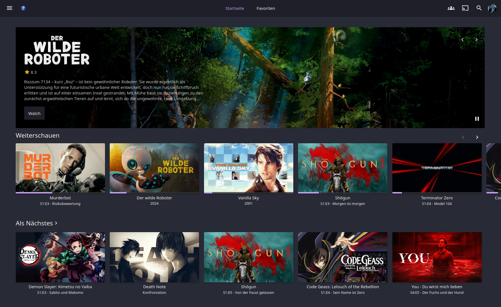

# Dracula for [Jellyfin](https://jellyfin.org)

> A dark theme for [Jellyfin](https://jellyfin.org).
>
> The Dracula Theme for Jellyfin is a fork of the awesome [Catppuccin theme](https://github.com/catppuccin/jellyfin) - many thanks to [these awesome contributors.](https://github.com/catppuccin/jellyfin/graphs/contributors)

## Install

All instructions can be found at [draculatheme.com/jellyfin](https://draculatheme.com/jellyfin).

## Team

This theme is maintained by the following person(s) and a bunch of [awesome contributors](https://github.com/dracula/jellyfin/graphs/contributors).

|  |
| ------------------------------------------------------------------------------ |
| [Domoel](https://github.com/Domoel)                                            |

## Community

- [Twitter](https://twitter.com/draculatheme) - Best for getting updates about themes and new stuff.
- [GitHub](https://github.com/dracula/dracula-theme/discussions) - Best for asking questions and discussing issues.
- [Discord](https://draculatheme.com/discord-invite) - Best for hanging out with the community.

## Dracula PRO

## License

[MIT License](./LICENSE)
